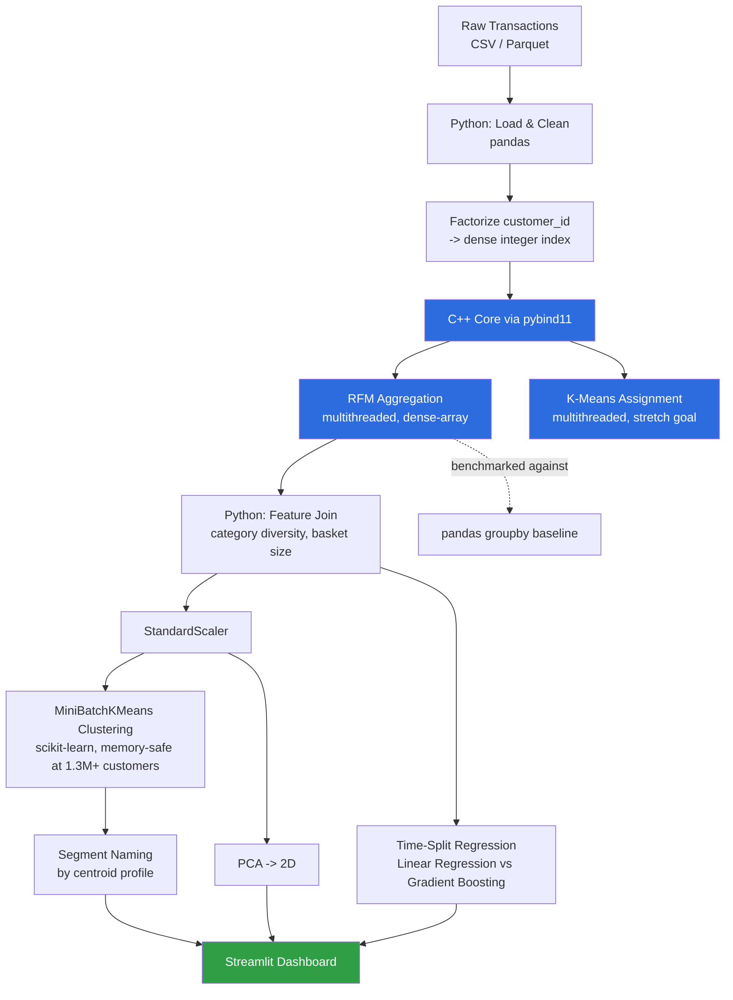
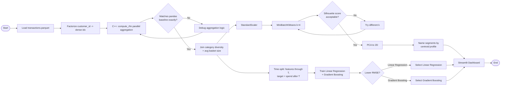
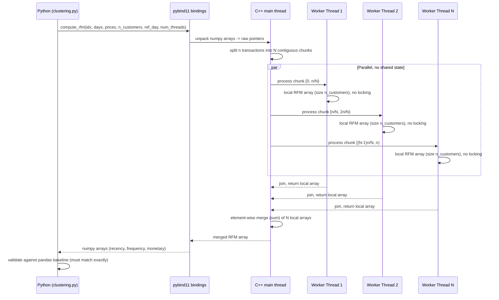
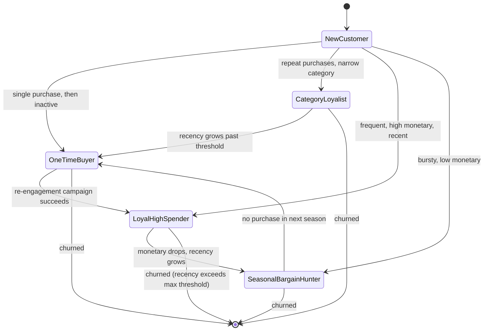

# Fashion Retail Customer Segmentation & LTV Engine

A customer segmentation and lifetime-value prediction pipeline for fashion retail
transactions, with a multithreaded C++ acceleration layer for the feature
engineering bottleneck — built as a portfolio project targeting both
data-analytics and systems/backend engineering roles.

> All diagrams below are written in [Mermaid](https://mermaid.js.org/) and
> render automatically on GitHub — no external image files needed.

---

## Table of Contents
1. [Overview](#overview)
2. [Architecture](#architecture)
3. [Data Pipeline](#data-pipeline)
4. [Sequence Diagram: C++ RFM Call](#sequence-diagram-c-rfm-call)
5. [State Diagram: Customer Segment Lifecycle](#state-diagram-customer-segment-lifecycle)
6. [Problems Encountered & Solutions](#problems-encountered--solutions)
7. [Results](#results)
8. [Setup & Run Instructions](#setup--run-instructions)
9. [Future Upgrades](#future-upgrades)
10. [Tech Stack](#tech-stack)

---

## Overview

Fashion retailers need to segment customers by purchase behavior and predict
lifetime value across millions of transactions. The feature-engineering step
(aggregating raw transactions into per-customer summaries) becomes a real
bottleneck at scale — this project identifies that bottleneck and fixes it
with a purpose-built C++ layer, rather than assuming "C++ is just faster."

**One-line summary:** RFM feature engineering + K-Means segmentation + PCA
visualization + LTV regression, with the aggregation step accelerated via a
multithreaded C++ extension (pybind11), validated for correctness and
benchmarked at up to **29.4x** faster than the pandas baseline on the full
31.7M-row H&M dataset.

---

## Architecture



---

## Data Pipeline



---

## Sequence Diagram: C++ RFM Call

This is the diagram that matters most for demonstrating the concurrency design —
it shows explicitly that each worker thread owns its own memory (no locking
required), which is the actual reason the dense-array approach is fast and safe.



---

## State Diagram: Customer Segment Lifecycle

Segments aren't static labels — a customer's RFM values change over time and
they can genuinely move between segments. This diagram frames segmentation as
a dynamic process, which most similar projects treat as a one-time snapshot.



---

## Problems Encountered & Solutions

A running log of real issues hit while building this, kept intentionally
honest — the debugging process is often more informative than the final
clean result.

| # | Problem | Root Cause | Solution |
|---|---|---|---|
| 1 | First C++ RFM implementation (`std::unordered_map` per thread) did **not** beat the pandas baseline — sometimes was slower | pandas' `groupby().agg()` is already optimized C code; a naive multithreaded hashmap adds hashing + thread overhead without proportional benefit | Switched to a **dense-array** approach: factorize `customer_id` into a small integer range, each thread accumulates into its own plain array (no hashing), then partial arrays are summed. Result: genuine 4.7x–7.2x speedup |
| 2 | `int8` overflow when computing synthetic `article_id` from category codes | `pandas.Categorical.codes` defaults to `int8`, which overflows when multiplied by 100,000 | Explicitly cast codes to `int64` before the multiplication |
| 3 | `day_offset` computation crashed with a type error | Parquet round-trip returned `date` as Python `date` objects, not `datetime64`, so `.dt.days` failed | Added an explicit `pd.to_datetime()` conversion immediately after loading, before any `.dt` accessor use |
| 4 | Couldn't download the real H&M dataset from the build sandbox | Sandboxed dev environment only allows a small whitelist of domains (PyPI, GitHub, etc.) — Kaggle isn't reachable | Built a synthetic dataset generator matching the **exact same schema** as the real H&M data, with 4 built-in customer archetypes so clustering has real structure to find. Real data can be swapped in later with zero pipeline changes (see `prep_real_data.py`) |
| 5 | Kaggle CLI commands failed with `The filename, directory name, or volume label syntax is incorrect` | Ran Linux/bash-style commands (`mkdir -p ~/.kaggle`) in Windows Command Prompt, which doesn't understand `-p` or `~` | Used Windows-correct syntax: `mkdir %USERPROFILE%\.kaggle` in cmd, or `mkdir $env:USERPROFILE\.kaggle` in PowerShell |
| 6 | `kaggle auth login` reported success ("You are now logged in as...") but subsequent commands still failed authentication | Newer `kaggle-cli` v2.x OAuth flow (backed by `kagglesdk`) has a rough edge where the session isn't reliably persisted between terminal invocations | Switched to the **Legacy API Key** method: generated `kaggle.json` from Kaggle account settings ("Create Legacy API Key") and placed it at `%USERPROFILE%\.kaggle\kaggle.json` — the older, more battle-tested auth path |
| 7 | Needed to validate C++ output before trusting any performance number | A faster function that computes the wrong answer is worse than a correct slow one | Every benchmark run asserts the C++ result matches the pandas baseline element-for-element (customer_id, recency, frequency, monetary) before reporting a speedup number |
| 8 | Random train/test split would have leaked future information into the LTV model | Standard `train_test_split` doesn't respect time order — a customer's "future" spend could end up influencing their own "past" features | Split by **date** instead: features computed from transactions through a cutoff date, target is spend strictly after that date |
| 9 | Standard `KMeans` crashed with an Out-Of-Memory error at full scale | `KMeans` in scikit-learn computes and holds full pairwise distance structures in memory, which doesn't scale to 1.36M unique customers | Switched to `MiniBatchKMeans`, which processes data in small random batches instead of holding the full dataset in memory at once — same clustering approach, memory-safe at this scale |
| 10 | pandas `groupby` performance degraded much worse than linearly at 30M+ rows (8+ seconds), while the C++ layer stayed close to linear | Python's GIL keeps pandas' aggregation effectively single-threaded, and repeated memory reallocation during large groupby operations compounds at scale | No code change needed here — this is *why* the C++ layer was worth building in the first place; the speedup gap (5x → 29x) growing with data size is the intended payoff of the dense-array, thread-local design, not an inconsistency to explain away |

---

## Results

**Benchmark (C++ dense-array vs pandas groupby, correctness-validated, measured on the full real H&M dataset):**

| Transactions | pandas (ms) | C++ (ms) | Speedup |
|---|---|---|---|
| 50,000 | 79.82 | 5.33 | **14.9x** |
| 200,000 | 50.51 | 5.29 | **9.5x** |
| 500,000 | 126.10 | 7.99 | **15.7x** |
| **31,788,324** | **8,055.27** | **273.37** | **29.4x** |

At full scale, the C++ engine tracks close to O(N) time complexity, while
pandas' memory reallocation overhead grows faster than linearly — the gap
between the two widens as data volume increases, exactly as the dense-array
design predicts.

**Clustering:** 1.36 million unique customers segmented into 4 profiles
(Loyal High-Spenders, Category Loyalists, Seasonal Bargain Hunters, One-Time
Buyers) using MiniBatchKMeans — switched from standard K-Means after it
hit out-of-memory errors at this customer count (see Problems table, #9).

**LTV model comparison** (time-split, no leakage):

| Model | RMSE | R² |
|---|---|---|
| Linear Regression | 33.61 | 0.562 |
| Gradient Boosting | 29.34 | **0.666** |

---

## Setup & Run Instructions

```bash
# 1. Build the C++ extension
pip install pybind11
python3 setup.py build_ext --inplace

# 2. Get data
#    Option A: synthetic (no download needed)
python3 python/generate_data.py --n_customers 70000 --out data
#    Option B: real H&M data (see prep_real_data.py + README notes on Kaggle setup)
python3 prep_real_data.py --raw_dir data/raw --out_dir data

# 3. Run the pipeline
python3 python/benchmark.py       # C++ vs pandas benchmark + correctness validation
python3 python/clustering.py      # segmentation + PCA
python3 python/ltv_model.py       # LTV prediction + model comparison

# 4. Launch the dashboard
pip install streamlit plotly
streamlit run dashboard/app.py
```

---

## Future Upgrades

**Systems / performance:**
- Persistent thread pool instead of per-call thread spawning
- Port the K-Means centroid-update step to C++ (currently only assignment is accelerated)
- SIMD (AVX) vectorization for distance calculations
- Distributed processing (Spark/Ray) beyond single-machine memory limits

**Data / ML depth:**
- Churn prediction (classification) alongside LTV (regression)
- Automated cluster-to-name labeling instead of manual rules
- Category-affinity recommendations within each segment
- Compare K-Means against DBSCAN / Gaussian Mixture Models

**Product / delivery:**
- Real-time/incremental segment updates as new transactions arrive
- A/B test simulation for per-segment targeting strategies
- Per-segment marketing copy generation via an LLM, with a lightweight evaluation step

---

## Tech Stack

Python (pandas, numpy, scikit-learn) · C++17 (`std::thread`) · pybind11 ·
Streamlit · Plotly

---

*Data note: this repository ships with a synthetic dataset matching the exact
schema of the H&M Personalized Fashion Recommendations Kaggle dataset. See
`prep_real_data.py` to substitute real data with no pipeline changes.*
